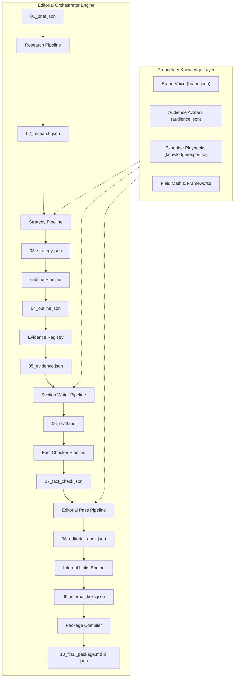
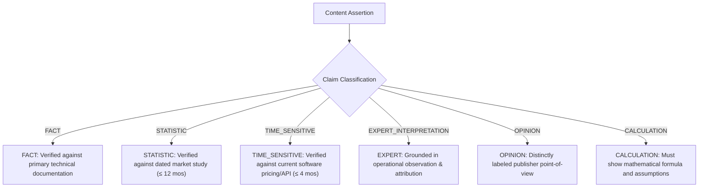

# `i-have-blog` Technical Architecture Specification

> **Deep-dive architectural specification for the AI Editorial Operating System.**

---

## 1. Core Architectural Thesis: Orchestrator vs. Multi-Agent Sprawl

Most generative AI systems for long-form content suffer from two opposing anti-patterns:

```
[Anti-Pattern A: Monolithic Prompt]
Prompt: "Write a 3000-word SEO post about X" 
   --> Produces 11th generic article, hallucinations, clichés, repetitive fluff.

[Anti-Pattern B: Multi-Agent Sprawl]
Agent 1 <---> Agent 2 <---> Agent 3 ... (13 Agents in chatting loops)
   --> Context drift, massive token burn (5x-10x), loss of grounding, unreproducible outputs.
```

### The `i-have-blog` Paradigm: Deterministic Orchestrator + Strict Stage Artifacts

`i-have-blog` utilizes a **Single Deterministic Orchestrator** managing **Modular Pipeline Stages**. Each stage operates as a bounded transformation function that takes typed input schemas and emits inspectable JSON or Markdown artifacts stored under `projects/<slug>/`.



---

## 2. The 10-Stage Pipeline Lifecycle & Artifact Contracts

Every stage in `core/orchestrator.py` adheres to an immutable file contract:

| Stage # | Pipeline Name | Primary Input | Produced Artifact | Core Responsibility |
| :---: | :--- | :--- | :--- | :--- |
| **01** | **Briefing** | User CLI / Prompt | `01_brief.json` | Captures topic, primary keyword, audience persona, and word targets. |
| **02** | **Research** | `01_brief.json` | `02_research.json` | Deconstructs search intent, builds SERP coverage matrix, identifies gaps. |
| **03** | **Strategy** | `02_research.json` | `03_strategy.json` | Semantic entity mapping, title variants, and contrarian differentiation angle. |
| **04** | **Outline** | `03_strategy.json` | `04_outline.json` | Intent-mapped architectural headings (H2/H3) with specific section goals. |
| **05** | **Evidence** | `04_outline.json` | `05_evidence.json` | Catalogs required facts, establishes Claim Ledger, assigns `[claim:C-xxx]`. |
| **06** | **Writer** | `05_evidence.json` | `06_draft.md` | Generates section-by-section prose with inline claim tag annotations. |
| **07** | **Fact-Check** | `06_draft.md` | `07_fact_check.json` | Validates claims against evidence ledger, checks freshness policy. |
| **08** | **Editorial** | `06_draft.md` | `08_editorial_audit.json` | Removes AI clichés, verifies rhythm, scores punchiness and differentiation. |
| **09** | **Linking** | `08_editorial_audit.json`| `09_internal_links.json` | Semantic anchor mapping and cluster graph recommendation. |
| **10** | **Package** | All prior artifacts | `10_final_package.md` | Production output with frontmatter, clean Markdown, FAQ, and Schema. |

---

## 3. Claim Classification & Evidence Ledger

Unlike simplistic systems that demand a formal citation for every sentence or completely neglect verification, `i-have-blog` categorizes assertions into six strict claim classes:



### Claim Tag Lifecycle
1. **Generation**: The Writer pipeline embeds `[claim:C-014]` directly in section drafts.
2. **Indexing**: The `ClaimRegistry` registers the text, source, confidence score, and timestamp.
3. **Auditing**: The `FactCheckerPipeline` ensures no untracked `[claim:C-xxx]` tags exist.
4. **Resolution**: The compiler strips internal tags and produces clean markdown with standard footnote links.

---

## 4. The Differentiation Scoring Algorithm

The **Differentiation Score (0–100)** measures the degree to which an article offers unique insight beyond generic SERP scraping:

$$\text{Score} = \text{Base}(50) + \Delta_{\text{Formulas}} + \Delta_{\text{Data Tables}} + \Delta_{\text{Empirical Quant}} + \Delta_{\text{Frameworks}}$$

- **Mathematical Proof ($\Delta_{\text{Formulas}}$)**: $+15$ points for worked equations ($\LaTeX$).
- **Structured Data ($\Delta_{\text{Data Tables}}$)**: $+12$ points for comparative markdown matrices.
- **Empirical Quantification ($\Delta_{\text{Empirical Quant}}$)**: $+12$ points for specific numbers, margins, or dollar amounts.
- **Proprietary Frameworks ($\Delta_{\text{Frameworks}}$)**: $+4$ points per verified framework from `knowledge/`.

Articles scoring below **70.0** are gated from production release.

---

## 5. Content Decay Engine & Refresh Protocol

For existing content assets, `RefreshPipeline` calculates a composite **Content Decay Score**:

$$\text{Decay} = (\text{Traffic Loss \%} \times 0.35) + (\text{SERP Drift} \times 0.30) + (\min(\text{Stale Claims} \times 12, 100) \times 0.25) + (\min(\text{Age Mos} \times 3, 100) \times 0.10)$$

| Decay Score | Recommended Action | Operational Playbook |
| :---: | :---: | :--- |
| **0.0 – 24.9** | `KEEP` | Asset is evergreen and dominant. No edits required. |
| **25.0 – 49.9** | `KEEP_MONITOR` | Stable asset. Re-evaluate in 90 days; add 1–2 internal links. |
| **50.0 – 74.9** | `UPDATE` | Surgical update: refresh outdated claims, update pricing, add fresh data. |
| **75.0 – 100.0** | `EXPAND_AND_REWRITE` | Full architectural overhaul: search intent has drifted. Rewrite outline. |
