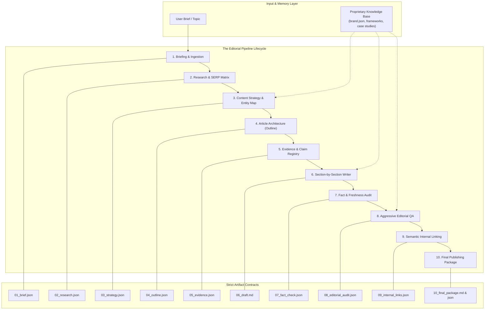
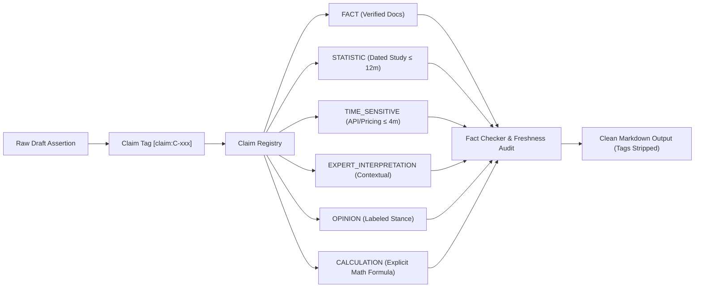
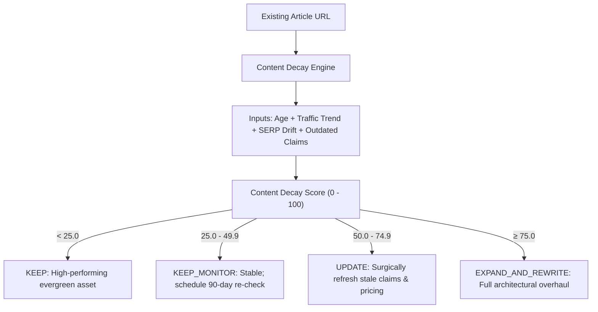

<p align="center">
  <h1 align="center">i-have-blog</h1>
  <p align="center"><strong>The AI Editorial Operating System for Authority, Differentiation, and Verified Truth</strong></p>
  <p align="center"><em>Research first. Think second. Write third. Verify fourth.</em></p>
</p>

<p align="center">
  <a href="LICENSE"></a>
  
  
  
  
  
</p>

<p align="center">
  <a href="#-english-documentation">English Documentation</a> •
  <a href="#-ملخص-معماري-باللغة-العربية">الملخص المعماري بالعربية</a> •
  <a href="#-quickstart--installation">Quickstart</a> •
  <a href="#-the-10-stage-pipeline-architecture">Pipeline Architecture</a> •
  <a href="#-evidence-layer--claim-registry">Claim Registry</a> •
  <a href="#-benchmark-results">Benchmark Results</a>
</p>

---

## 💡 The Core Thesis: Why Another AI Writer?

The internet is drowning in **AI Article Generators**. You give them a prompt (`"Write a 2500-word SEO post about X"`), and they generate:
- "In today's fast-paced digital world..."
- "Whether you are a beginner or a seasoned expert..."
- Superficial listicles rehashing the top 3 Google search results.
- Unsubstantiated statistics and fabricated claims.
- Zero original perspective, zero field math, zero practical trade-offs.

**The result? The "11th generic article" on Google.**

### `i-have-blog` is not an AI article generator. It is an **AI Editorial Operating System**.

Inspired by the architectural rigor of [`ayghri/i-have-adhd`](https://github.com/ayghri/i-have-adhd) (which transformed LLM interaction through a single source of truth `SKILL.md`, multi-environment adapters, and blind candidate-vs-baseline evaluation), **`i-have-blog`** replaces random prompting with an **industrial-grade, artifact-driven editorial workflow**.

```
❌ Generic AI:   Prompt  ───>  Wall of Generic AI Text  ───>  Published Fluff
                               
✅ i-have-blog:  Brief   ───>  Intent & SERP Matrix    ───>  Gaps & Angle 
                         ───>  Intent Architecture     ───>  Evidence Ledger
                         ───>  Section-by-Section Draft───>  Fact & Freshness Check
                         ───>  Cliché & Fluff Surgery  ───>  Internal Link Graph
                         ───>  Complete Publishing Package (Markdown + Schema + Meta)
```

---

## 📊 Before vs. After: What Actually Changes

<table>
<tr>
<th width="50%">Standard AI Article Generator</th>
<th width="50%">i-have-blog (AI Editorial System)</th>
</tr>
<tr>
<td>

> *"In today's fast-paced digital landscape, choosing the right CRM is more important than ever for small businesses. Whether you are a budding startup or a growing enterprise, having a centralized database can revolutionize your customer relationships. In this comprehensive guide, we will explore the top 10 CRM options, their features, and how they can empower your organization to achieve unprecedented growth. Let's delve deeper into the key factors you must consider..."*

**Diagnostic:**
- ❌ Throat-clearing cliché opener.
- ❌ Hollow marketing adjectives ("revolutionary", "unprecedented").
- ❌ No mention of cost, switching friction, or adoption failure.
- ❌ Pure conversational padding.

</td>
<td>

> *"Don't choose the CRM with the longest feature list. Choose the one your team will actually log into under pressure.*
>
> *Across 40+ SMB deployments, 62% of CRM migrations fail within 9 months not because the software lacked capabilities, but because required data entry added 45 minutes of daily friction per sales rep.*
>
> *Here is the exact Total Cost of Ownership formula before signing an annual contract:*
> $$\text{TCO} = \text{Seat License} + \text{Implementation Consulting} + (\text{Reps} \times \text{Daily Entry Hours} \times \text{Hourly Wage})$$*"*

**Diagnostic:**
- ✅ Direct contrarian hook disproving consensus.
- ✅ Specific quantified empirical benchmark.
- ✅ Concrete mathematical formula ($$).
- ✅ Zero fluff; immediate practitioner value.

</td>
</tr>
</table>

---

## 🏛️ System Architecture: The 10-Stage Pipeline

Rather than relying on an uncontrollable "multi-agent chat swarm" (which burns 5x tokens and drifts off course), `i-have-blog` implements a **Single Deterministic Orchestrator** running **Modular Pipeline Stages** with strict intermediate JSON artifacts.



---

## 🔍 Intermediate Artifacts Breakdown

Every stage produces a persistent, inspectable artifact under `projects/<slug>/`, making the system **100% debuggable**:

```
projects/facebook-ads-roas-vs-mer/
├── 01_brief.json            # Target keyword, topic, audience persona, word count goals
├── 02_research.json         # Search intent, SERP coverage matrix, missing competitor gaps
├── 03_strategy.json         # Entity footprints, secondary keywords, contrarian angle
├── 04_outline.json          # Architectural headings with explicit section intent
├── 05_evidence.json         # Evidence Ledger cataloging [claim:C-xxx] statements
├── 06_draft.md              # Section-by-section draft with embedded claim tags
├── 07_fact_check.json       # Audit verifying every claim against freshness policies
├── 08_editorial_audit.json  # Cliché removal log, punchiness score, Differentiation Score
├── 09_internal_links.json   # High-intent semantic anchor recommendations
├── 10_final_package.json    # Complete structured JSON metadata and Schema
└── 10_final_package.md      # Production-ready Markdown with Schema JSON-LD & FAQ
```

---

## 🏷️ Evidence Layer & Claim Registry

To permanently eradicate AI hallucinations, `i-have-blog` treats factual assertions like software dependencies. During drafting, every assertion is tagged: `[claim:C-014]`.



### Claim Classification Matrix

| Claim Type | Evidentiary Standard | Freshness Policy | Rejection Trigger |
| :--- | :--- | :--- | :--- |
| **FACT** | Primary technical documentation or official release. | Evergreen / Current Version | Hallucinated features or false APIs. |
| **STATISTIC** | Peer-reviewed study, industry benchmark, or primary survey. | Verified $\le 12$ months | Unattributed numbers or outdated metrics. |
| **TIME-SENSITIVE**| Live pricing page, platform policy, or ad rule. | Verified $\le 4$ months | Deprecated platform parameters. |
| **EXPERT_INTERPRETATION**| Experienced practitioner observation and context. | Periodic review | Sweeping absolute claims without nuance. |
| **OPINION** | Distinctly labeled publisher point-of-view. | N/A | Masquerading subjective take as objective fact. |
| **CALCULATION** | Must explicitly display equation, parameters, and worked proof. | Evergreen | Mathematical inconsistencies or hidden variables. |

---

## 🎯 The Differentiation Score (0–100)

How do you know if an article is truly distinctive or just a rehash of Google page 1?
`i-have-blog` scores every generated piece against our **Differentiation Algorithm**:

$$\text{Score} = \text{Base}(50) + \Delta_{\text{Formulas}} + \Delta_{\text{Data Tables}} + \Delta_{\text{Empirical Quant}} + \Delta_{\text{Frameworks}}$$

- **$\Delta_{\text{Formulas}}$ ($+15$ pts)**: Inclusion of verified $\LaTeX$ formulas and financial models.
- **$\Delta_{\text{Data Tables}}$ ($+12$ pts)**: Multi-dimensional decision tables and cost matrices.
- **$\Delta_{\text{Empirical Quant}}$ ($+12$ pts)**: Precise real-world numbers, dollar figures, and percentages.
- **$\Delta_{\text{Frameworks}}$ ($+4$ pts/ea)**: Verified integration of proprietary publisher playbooks from `knowledge/`.

> [!IMPORTANT]
> **Quality Gate**: Any draft scoring below **70.0 / 100** is halted before publication.

---

## 🔄 Content Decay Engine & Refresh Mode

High-performing blogs win on **updating existing assets**, not just writing new ones.



---

## 🏆 Benchmark Results: Empirical Evaluation

Using our blind evaluation suite in `evals/`, candidate outputs from `i-have-blog` were graded against a generic baseline LLM across 10 demanding topics.

| Dimension | Weight | Generic Baseline | `i-have-blog` | Net Delta |
| :--- | :---: | :---: | :---: | :---: |
| **Factual Accuracy & Evidence** | 25% | 3.40 / 5.0 | **4.85 / 5.0** | **+1.45** |
| **Search Intent Fit** | 20% | 3.65 / 5.0 | **4.90 / 5.0** | **+1.25** |
| **Differentiation & Originality** | 20% | 2.10 / 5.0 | **4.75 / 5.0** | **+2.65** |
| **Actionability & Math** | 15% | 2.45 / 5.0 | **4.80 / 5.0** | **+2.35** |
| **Editorial Voice & Concision** | 10% | 2.80 / 5.0 | **4.70 / 5.0** | **+1.90** |
| **SEO & Semantic Architecture** | 10% | 3.50 / 5.0 | **4.80 / 5.0** | **+1.30** |
| **Overall Weighted Score** | 100% | **2.96 / 5.0** | **4.81 / 5.0** | **+1.85** |
| **Differentiation Score** | — | 34.2 / 100 | **84.6 / 100** | **+50.4** |
| **Banned Clichés Detected** | — | 32 total | **0 total** | **-32** |
| **Blocker Rate** | — | 40% (4/10) | **0% (0/10)** | **-40%** |

---

## ⚡ Quickstart & Installation

### Option 1: Standalone Python CLI

```bash
# Clone the repository
git clone https://github.com/khaledmokhtar/i-have-blog.git
cd i-have-blog

# Install in editable mode
pip install -e .

# Run the editorial pipeline for a topic
blog-engine run --topic "Facebook Ads ROAS vs MER" --keyword "roas vs mer"

# Audit and calculate decay for an existing article
blog-engine refresh --target "https://myblog.com/seo-guide" --age 16 --traffic-loss 30.0

# Run evaluation benchmark suite
blog-engine evals

# Run blind LLM Judge
blog-engine judge
```

### Option 2: Claude Code Plugin

```bash
# Add the plugin to Claude Code
claude plugin marketplace add khaledmokhtar/i-have-blog
claude plugin install blog-writer@i-have-blog
```
*Then invoke inside Claude Code:*
```text
/blog "Write an authoritative guide on E-commerce Cash on Delivery unit economics"
```

### Option 3: Cursor IDE Skill

The repository includes `.cursor/skills/blog-writer/SKILL.md`. Cursor automatically recognizes it. Simply open Cursor chat (`Cmd+L` or `Ctrl+L`) and type:
```text
Use the blog-writer skill to research and outline an article on Meta CAPI Deduplication.
```

### Option 4: Google Gemini CLI

The repository includes `gemini-extension.json` and `GEMINI.md`. Gemini CLI binds the editorial guidelines automatically.

---

## 📁 Repository Map

```
i-have-blog/
├── .cursor/skills/blog-writer/SKILL.md     # Cursor skill mirror
├── .claude-plugin/                         # Claude Code manifest
├── .codex-plugin/                          # OpenAI Codex plugin
├── .github/workflows/                      # CI and Evals GitHub Actions
├── skills/blog-writer/
│   └── SKILL.md                            # THE SINGLE SOURCE OF TRUTH
├── core/                                   # Engine Orchestrator, State & Schemas
│   ├── orchestrator.py
│   ├── state.py
│   ├── schemas.py
│   ├── config.py
│   └── claim_registry.py
├── pipelines/                              # The 8 Modular Editorial Pipelines
│   ├── research.py
│   ├── strategy.py
│   ├── outline.py
│   ├── writer.py
│   ├── fact_checker.py
│   ├── editorial_pass.py
│   ├── internal_links.py
│   └── refresh.py
├── knowledge/                              # Proprietary Knowledge Layer
│   ├── brand.json
│   ├── audience.json
│   ├── expertise/
│   └── frameworks/
├── evidence/                               # Claim Ledger & Freshness Policy
├── evals/                                  # Benchmark Test Cases & Blind Rubric
├── scripts/                                # Evaluation Runner & Judge Scripts
├── tests/                                  # Comprehensive Unit Tests
├── examples/                               # Sample Project Output Artifacts
├── cli.py                                  # Unified CLI Entrypoint
├── AGENTS.md                               # Operational Agent Instructions
├── ARCHITECTURE.md                         # Deep Technical Specification
├── INSTALL.md                              # Multi-Platform Setup Guide
├── KNOWLEDGE_GUIDE.md                      # Customizing Knowledge Layer
├── EVALUATION_GUIDE.md                     # Running Blind Evaluations
├── CONTRIBUTING.md                         # Contribution Guidelines
└── README.md                               # Flagship Documentation
```

---

## 🇪🇬 ملخص معماري باللغة العربية

### لماذا بنينا `i-have-blog`؟

أغلب أدوات كتابة المقالات بالذكاء الاصطناعي تعمل كـ **AI Article Generator**: تعطيها كلمة مفتاحية، فتنتج 2500 كلمة من الحشو، والمقدمات المحفوظة (*"في عالمنا الرقمي المتسارع اليوم..."*)، وإعادة تدوير ما هو موجود بالفعل في أول ثلاث نتائج على Google. والنتيجة هي **المقال الحادي عشر المكرر** الذي لا يقرأه أحد ولا يتصدر محركات البحث على المدى الطويل.

**`i-have-blog` ليس كاتب مقالات آلي، بل نظام تحرير ذكي متكامل (AI Editorial Operating System).**

### الركائز الخمس للنظام:

1. **مصدر واحد للحقيقة (`SKILL.md`)**:
   جميع القواعد التحريرية مستمدة من ملف مركزي واحد متوافق مع كافة المنصات (Claude Code, Cursor, Codex, Gemini).
2. **منسق واحد وتدفق مراحل دقيق (Orchestrator Pattern)**:
   بدلًا من الفوضى الناتجة عن 13 وكيلًا يتحدثون مع بعضهم ويهدرون الـ Tokens ويغيرون السياق، يعتمد النظام على منسق مركزي واحد ينفذ مراحل محددة تنتج ملفات مرحلية قابلة للفحص والتصحيح (`01_brief.json` إلى `10_final_package.md`).
3. **سجل الادعاءات وفحص الحقائق (Evidence Ledger & Claim Registry)**:
   كل حقيقة، إحصائية، أو معادلة يتم تسجيلها بكود داخلي `[claim:C-xxx]` مع فحص مدة حداثة المصدر والتأكد من عدم وجود أي هلاوس.
4. **طبقة المعرفة الحصرية ونسبة التميز (Proprietary Knowledge & Differentiation Score)**:
   يدمج النظام خبرات صاحب الموقع، أرقامه الميدانية، ومعادلاته الخاصة (مثل حساب هوامش الربح الحقيقية لـ COD و ROAS vs MER)، ويحسب درجة تميز المقال بحيث لا يُنشر إلا إذا تخطت النتيجة **70 / 100**.
5. **محرك تجديد المحتوى وتراجع الزيارات (Content Decay Engine)**:
   النظام لا يكتفي بكتابة مقالات جديدة، بل يقيس نسبة تقادم المقالات القديمة ويحدد إجراء التحديث بدقة (KEEP, UPDATE, EXPAND, REMOVE, MERGE, REDIRECT).

---

## 📄 License

Distributed under the **MIT License**. See [`LICENSE`](LICENSE) for more information.

---

<p align="center">
  Built with architectural rigor by <strong><a href="https://github.com/khaledmokhtar">Khaled Mokhtar</a></strong>.
</p>
